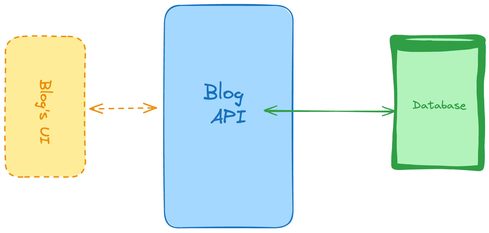
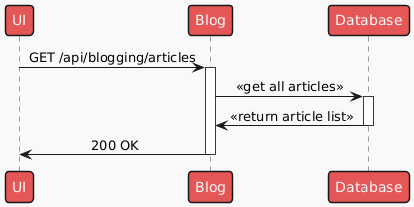
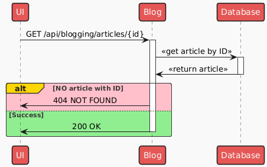
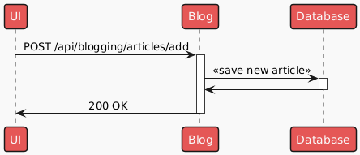
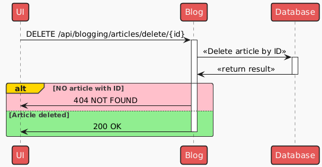
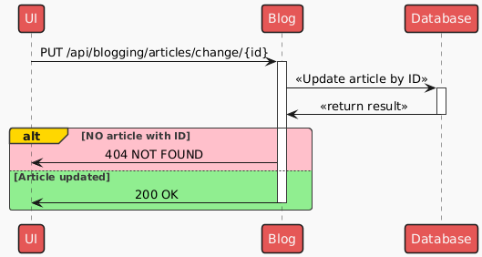

# Blogging Platform API

_The project covered the basic **CRUD** operations (Create, Read, Update and Delete)._

---

This is a REST-ful API that would power a personal blog with the responsibilities of:

- [x] TODO: Add diagram

- [x] Return a list of articles. (Should add filters such as publishing date, or tags.)

- [x] Return a single article, specified by the ID of the article.

- [x] Create a new article to be published.

- [x] Delete a single article, specified by the ID.

- [x] Update a single article, specify the article by its ID.

