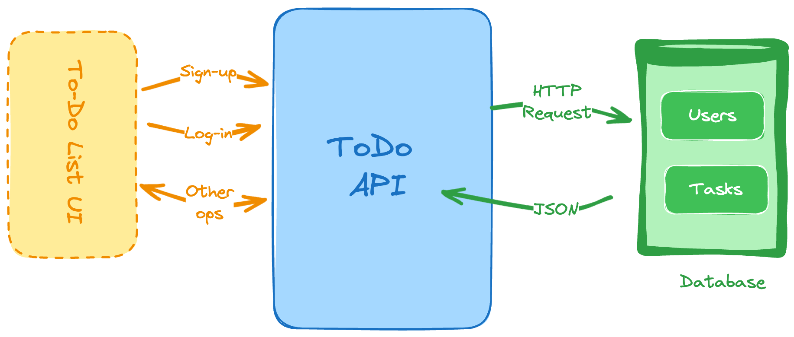

# To Do List API

_Basic CRUD with more extra functionalities. I took this opportunity to read more about HTTPS and SSL in Spring_

---

## Architecture

- [ ] Add diagrams 



- [ ] An authentication logic (a new table of users and their credentials).


- [ ] Create both users and tasks:
  - [ ] Users.
  - [ ] Tasks.


- [ ] Operation on tasks (their status) and even delete them.
  - [ ] Update tasks.
  - [ ] Delete tasks.


- [ ] Get a list of task.
- [ ] Filter tasks by status.
- [ ] Get the details of each one.


## Generate Self-signed SSL Certificate

I found this article[^article] online and it helped. I used the JDK built-in tool `keytool`. Run the following command inside `todolist` module root path:

```bash
keytool -genkeypair -alias todolist -keyalg RSA -keysize 4096 -storetype PKCS12 -keystore todolist.p12 -validity 3650 -storepass password
```

Flags explained:

- `genkeypair`: generates a key pair.
- `alias`: alias name for the key.
- `keyalg`: algorithm to generate key pair.
- `keysize`: size of the key, in bits
- `storetype`: type of the key.
- `keystore`: name of the keystore.
- `validity`: number of days until key expires.
- `storepass`: password for the keystore.

Skips all the information prompts and input `yes` when confirmation prompt appears. Put the `todolist.p12` into `resource` directory and add these in `application.yml`:

```yaml
server:
  ssl:
    key-store: classpath:todolist.p12
    key-store-password: password
    key-store-type: pkcs12
    key-alias: todolist
    key-password: password
  port: 8443
```

- `port`: the port the server operates on.
- `keystore`: path to the keystore.
- `key-store-password`: keystore password.
- `key-store-type`: type of keystore.
- `key-alias`: alias of the key.
- `key-password`: password to access the key.

## Disable CSRF

Spring Security provides support for protecting against CSRF - Cross-Site Request Forgery. Read more about it here[^1].

It must be disabled so that I can send POST request from Postman to the API. As for the reason why, this answer[^2] on StackOverFlow does wonders:

> Our recommendation is to use CSRF protection for any request that could be processed by a browser by normal users. If you are only creating a service that is used by non-browser clients, you will likely want to disable CSRF protection.

I do not use any UI in these projects (probably) so I will go ahead and remove this filter. How to disable `csrf` in Spring Security 6.3.3:

```java
import org.springframework.security.web.SecurityFilterChain;

@Bean
public SecurityFilterChain securityFilterChain(HttpSecurity http) throws Exception {
  ...
  http.csrf(AbstractHttpConfigurer::disable);
  // http.csrf(csrf -> csrf.disable());
  ...
  return http.build();
}
```

## Reference

[^1]: [Cross Site Request Forgery (CSRF)](https://docs.spring.io/spring-security/reference/features/exploits/csrf.html)

[^2]: [What is the reason to disable csrf in spring boot web application?](https://stackoverflow.com/questions/52363487/what-is-the-reason-to-disable-csrf-in-spring-boot-web-application)

[^article]: [How to enable HTTPS in a Spring Boot Java application](https://www.thomasvitale.com/https-spring-boot-ssl-certificate/)